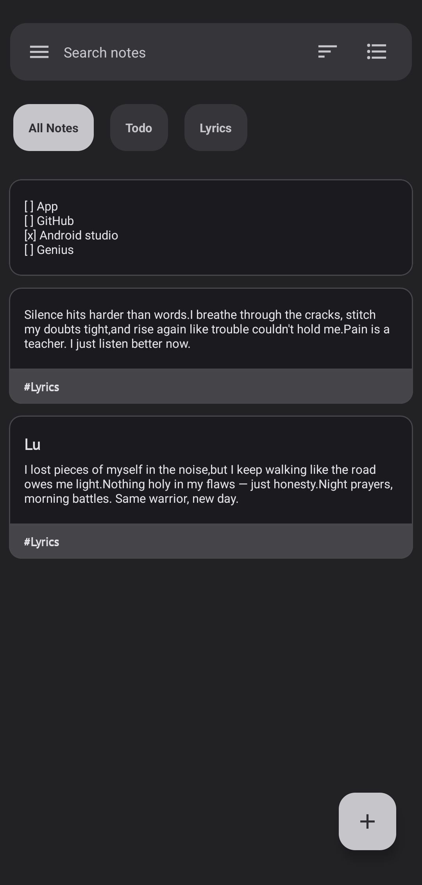
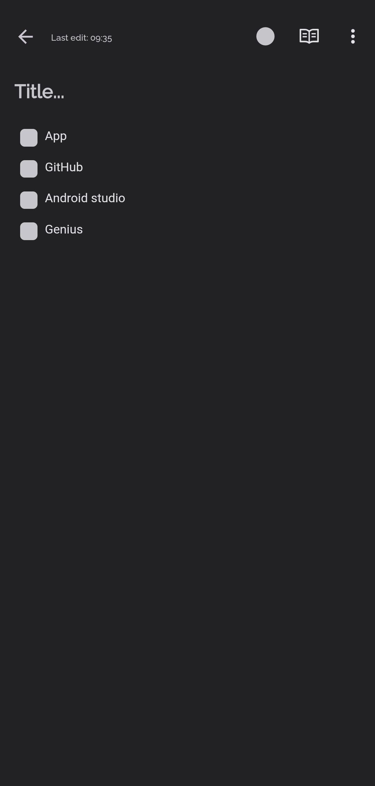

# My Notes

**My Notes** is a simple and convenient app for quickly jotting down notes.  
Organize your ideas, tasks, and important things without distractions.

## Screenshots

  
  

## Why My Notes?

My Notes was created for people who want a fast, clean and fully private note-taking experience.  
No accounts, no cloud, no ads — just your content stored safely on your device.

The goal is simple:  
**Open → Write → Close.**  
Zero distractions.

## Features

- 📥 Import from **Google Keep**
- 🏷️ **Tags** for sorting and searching notes
- ✍️ **Advanced editor** (headings, lists, quotes, formatting)
- 🎨 **Themes and colors** to match your mood
- 🚫 **No ads** — just your notes
- 🔒 **Fully offline** — no servers or remote cloud
- 💻 **Open-source** — transparent and accessible code
- 🎯 **Modern and intuitive design**

**My Notes** helps you capture ideas, organize your day, and always keep important information at
hand.

## Privacy

My Notes does not collect or send any data to external servers.  
All notes, attachments and preferences are stored **locally on the device**.  
No tracking, no analytics, no cloud — full privacy by design.

## Contribution

If you find bugs, issues, or have ideas to improve the app,  
please open a new [Issue](https://github.com/pasichDev/My-Notes/issues) in the project repository.

## License

This project is licensed under the terms of the [Apache License 2.0](./LICENSE).
